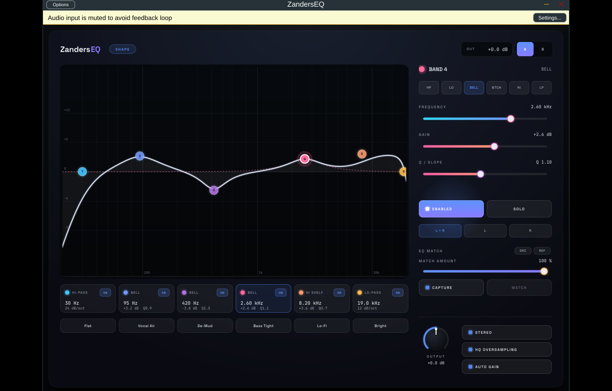

# ZandersEQ

[](https://github.com/zanders214/eq/actions/workflows/ci.yml)

A FabFilter Pro-Q-style **parametric EQ audio plugin** for DAWs (VST3 / AU / Standalone),
built with [JUCE](https://juce.com). The hero is a live frequency-response curve with a
real-time FFT spectrum behind it; you drag band nodes on the curve and refine them in the
side-rail editor.

This repository implements the design + DSP handoff in `design_handoff_zanderseq/` as a real
audio plugin. The HTML/JSX files in that folder are the *visual and behavioural spec*; the
shipping product is the JUCE plugin under `src/`.



## Features

- **6-band parametric EQ** (expandable via one constant). Per band: filter type
  (high-pass · low-shelf · bell · notch · high-shelf · low-pass), frequency (20 Hz–20 kHz,
  log), gain (±18 dB), Q (0.1–18), cut slope (12/24/48 dB/oct via cascaded biquads),
  enable and solo.
- **RBJ biquad engine** ported directly from `design/EQGraph.jsx`. The on-screen curve and
  the audio path are computed from *the same coefficients*, so the display never lies.
- **Real-time FFT analyzer** (`juce::dsp::FFT`, 2048-pt, log-frequency, peak-hold) drawn
  behind the response curve.
- **Draggable response curve** — drag a node for freq/gain, scroll a node for Q,
  double-click empty space to add a band, double-click a node to remove it, click to select.
- **Spectrum grab** — press-drag on empty analyzer space to spawn a bell snapped to the
  nearest spectral peak and pull it in one gesture.
- **Output gain** (±24 dB), global **Stereo / Mid-Side** domain, **HQ 2× oversampling**, and
  **Auto-gain** (loudness-matched output trim, shown live next to the toggle).
- **Per-band channel lane** — within the global domain each band targets Both / first / second
  (L+R·L·R in Stereo, M+S·M·S in Mid-Side); non-Both bands show an L/R/M/S letter on their node.
- **Dynamic EQ** (bell/shelf) — each band has a detector (band-pass + envelope follower) and a
  threshold/range/attack/release so its gain reacts to level (de-ess, tame resonances, boost
  transients). The curve animates live; a draggable handle on the node sets the dynamic range.
- **EQ match** — capture a reference (sidechain input) and the source simultaneously, then
  fit the 6 bands to their tonal-balance difference (greedy peak-pick + weighted
  least-squares), with a Match Amount control and a ghost target curve. Result stays fully
  editable. Fitter is unit-tested (`-DZEQ_BUILD_TESTS=ON`).
- **A/B** compare slots and the six README presets (Flat, Vocal Air, De-Mud, Bass Tight,
  Lo-Fi, Bright).
- All parameter changes are smoothed (no zipper noise); `processBlock` is real-time safe
  (no allocations or locks).
- Brand fonts (Space Grotesk + JetBrains Mono, both OFL) are bundled as binary data, so the
  UI renders identically offline.

## Building

Requires CMake ≥ 3.22 and a C++17 compiler. JUCE 8.0.13 is fetched automatically by CMake
(`FetchContent`) — no submodule needed.

```bash
cmake -B build -G Ninja -DCMAKE_BUILD_TYPE=Release
cmake --build build --parallel
```

Outputs land under `build/ZandersEQ_artefacts/Release/` (`VST3/`, `Standalone/`, and `AU/`
on macOS).

### Linux build dependencies

JUCE needs the usual audio/GUI dev packages:

```bash
sudo apt-get install libasound2-dev libjack-jackd2-dev libfreetype-dev libfontconfig1-dev \
  libx11-dev libxext-dev libxinerama-dev libxrandr-dev libxcursor-dev libxcomposite-dev \
  libgl1-mesa-dev libcurl4-openssl-dev
```

### Platforms

`VST3` and `Standalone` build everywhere; `AU` is added automatically on macOS. The design
targets a fixed 1100×690 panel.

## Project layout

| Path | What |
|---|---|
| `src/dsp/EqMath.h` | RBJ biquad coefficients + magnitude response (shared by audio & UI). |
| `src/dsp/Biquad.h` | TDF-II biquad + per-band cascade. |
| `src/Parameters.h` | APVTS layout, ranges, default band shape. |
| `src/Presets.h` | The six presets + apply/match. |
| `src/PluginProcessor.*` | EQ engine: M/S routing, solo, output, oversampling, FFT feed. |
| `src/gui/EqGraphComponent.*` | Analyzer + curve + draggable nodes (the hero). |
| `src/gui/BandStrip.*` · `PresetBar.*` · `BandEditorRail.*` | Strip, presets, side rail. |
| `src/gui/NeonLookAndFeel.*` · `Theme.h` | Design tokens, fonts, sliders, dial. |
| `resources/fonts/` | Bundled Space Grotesk + JetBrains Mono (OFL licensed). |

## Roadmap to true Pro-Q parity

See [`docs/ROADMAP.md`](docs/ROADMAP.md) for the proposed next features (dynamic EQ, per-band
channel modes, linear-phase mode, spectrum grab, auto-gain) — not yet built.

## Credits

Design system: *Neon Plugins* handoff. Fonts: Space Grotesk and JetBrains Mono (SIL Open
Font License — see `resources/fonts/`).
